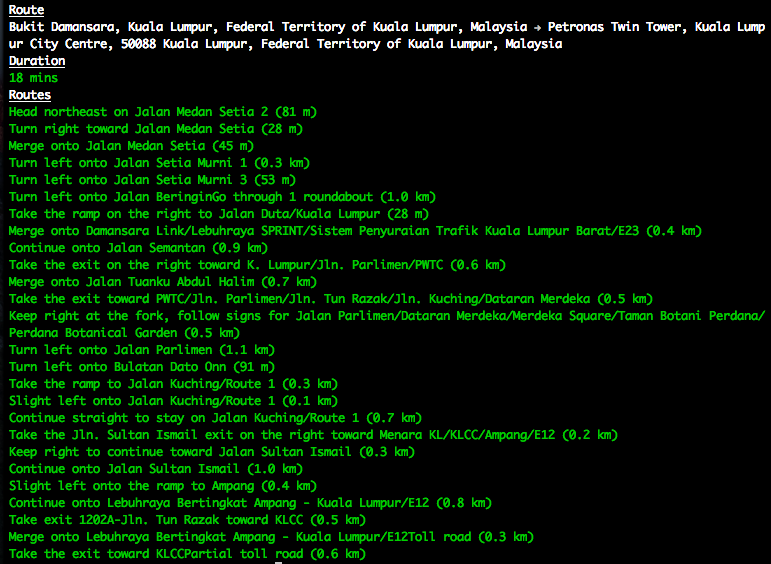

# Google Maps Direction API [](https://travis-ci.org/yujinlim/google-maps-direction-cli)
> a simple google maps direction cli, control your traffic via command prompt

The world is in your hand! Look up direction and traffic time via command prompt! Use api key for better traffic information, see [http://googlegeodevelopers.blogspot.my/2015/11/predicting-future-with-google-maps-apis.html](http://googlegeodevelopers.blogspot.my/2015/11/predicting-future-with-google-maps-apis.html)



## Install
```bash
npm i -g google-maps-direction-cli
```

## Usage
```bash
$ direction --help
  google maps direction cli

  Usage
   $ direction <origin> <destination>

  Options
   $ -k, --key Include api key for better traffic forecast (or DIRECTION_API_KEY environment variable)

  Examples
   $ direction "bukit damansara" "klcc"
   $ DIRECTION_API_KEY=API_KEY direction "bukit damansara" "klcc"
   $ direction "bukit damansara" "klcc" -k API_KEY

$ direction "bukit damansara" "klcc"
```
## Related
- [`google-maps-direction`](https://github.com/yujinlim/google-maps-direction)

for more information about parameters, please read more [here](https://developers.google.com/maps/documentation/directions/intro#RequestParameters)
